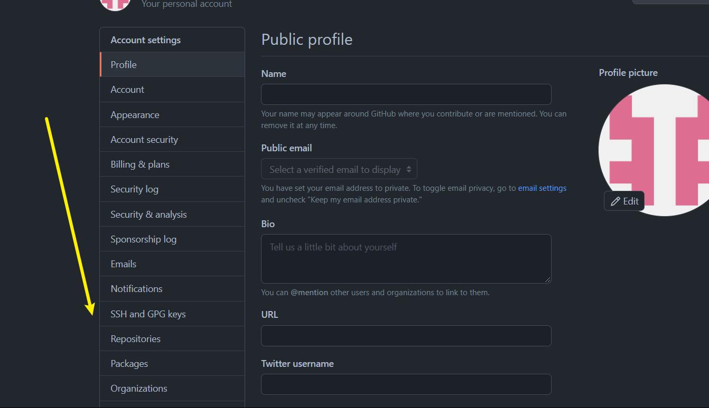
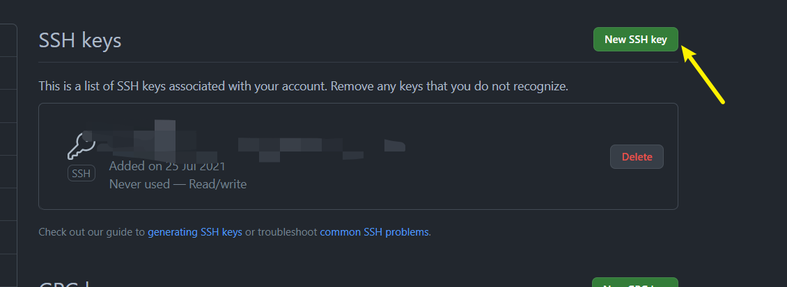

# Git使用SSH方法连接GitHub

## 什么是SSH

> SSH是一个加密远程连接方式，可以用来认证客户端与GitHub之间的连接。

## 检查现有SSH密钥

如果以前在使用本地git的时候生成过github密钥，那么可以在本地看得到
首先打开Git Bash,查看现有是否存在SSH密钥。

```shell
ls -al ~/.ssh
```

检查目录列表以查看是否已经有 SSH 公钥。 默认情况下，公钥的文件名是以下之一。
如果有的话，可以跳转到第三步，否则进行第二步。

## 生成新的SSH密钥

1. 打开Git Bash
2. 粘贴以下文本

   ```shell
    ssh-keygen -t ed25519 -C "your_email@example.com"
    或者，如果你的系统不支持以上的算法
    ssh-keygen -t rsa -b 4096 -C "your_email@example.com"
   ```

   **注意要替换掉上面的电子邮件为github想要认证的电子邮件账号**

3. 后面一直回车就行了，当然按照提示输入一些也没错。
4. 然后就会提示你在对应的位置生成了SSH私钥和公钥。

如果你是windows系统，一般会在`c:/windows/user`目录下面。如果是linux等系统，一般也能在对应的位置找到，留意命令行的生成信息就行。

## 将公钥粘贴到GitHub

1. 点击头像， 打开`setting`.
2. 打开SSH选项卡


3. 点击添加SSH Key，将刚才的公钥粘贴进去,Title随便取


## 验证GitHub连接

1. 打开 Git Bash。
2.  输入以下内容：
    
    ```
    $ ssh -T git@github.com
    # Attempts to ssh to GitHub
    ```
    
    您可能会看到类似如下的警告：
    
    ```
    > The authenticity of host 'github.com (IP ADDRESS)' can't be established.
    > RSA key fingerprint is SHA256:nThbg6kXUpJWGl7E1IGOCspRomTxdCARLviKw6E5SY8.
    > Are you sure you want to continue connecting (yes/no)?
    ```
    
3.  验证所看到消息中的指纹是否匹配 [GitHub 的 RSA 公钥指纹](https://docs.github.com/cn/github/authenticating-to-github/githubs-ssh-key-fingerprints)。 如果是，则输入 `yes`：
    
    ```
    > Hi username! You've successfully authenticated, but GitHub does not
    > provide shell access.
    ```
    
4.  验证生成的消息包含您的用户名。 如果收到 “权限被拒绝” 消息，请参阅 [“错误：权限被拒绝（公钥）”](https://docs.github.com/cn/articles/error-permission-denied-publickey)。